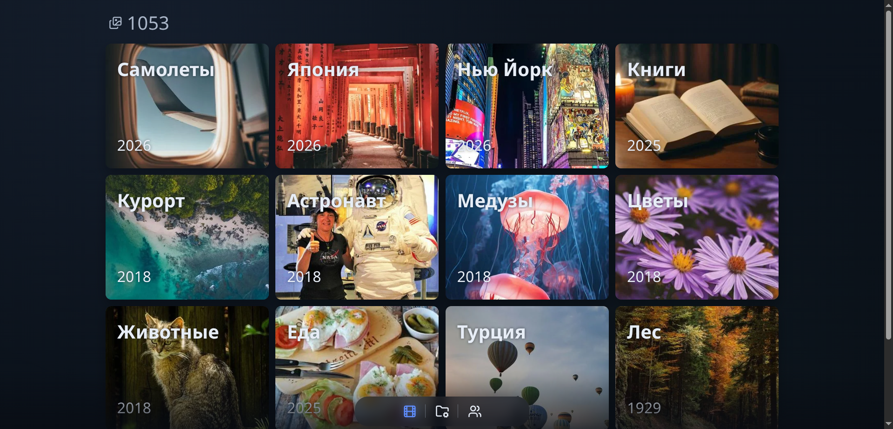
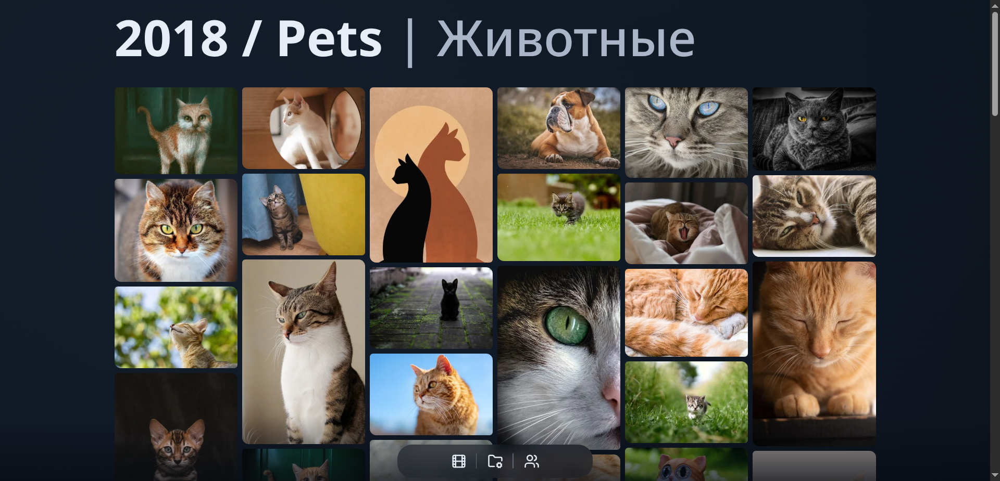
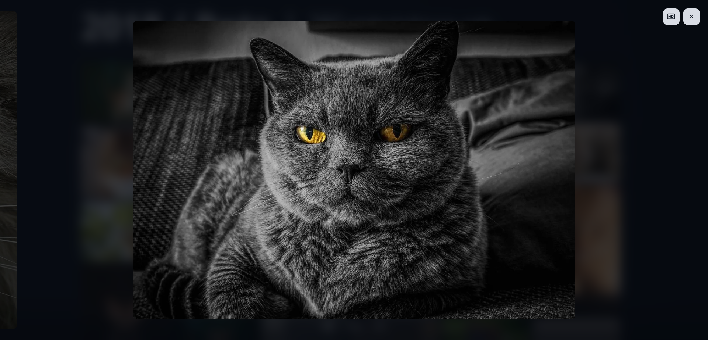
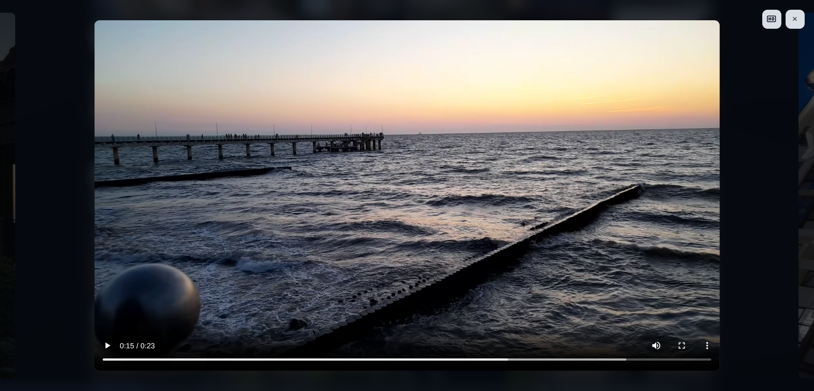
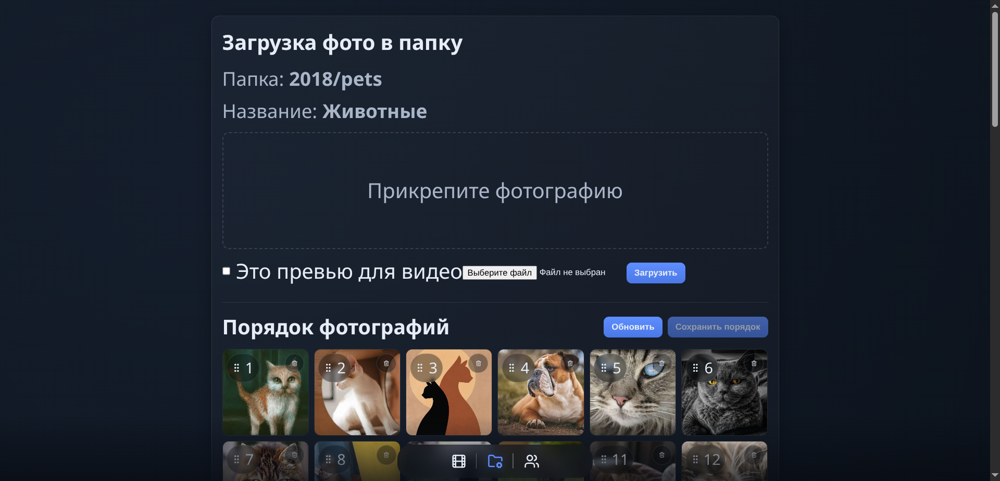
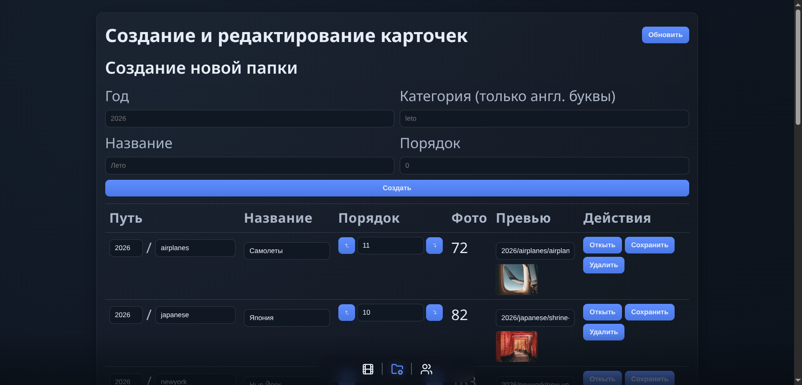
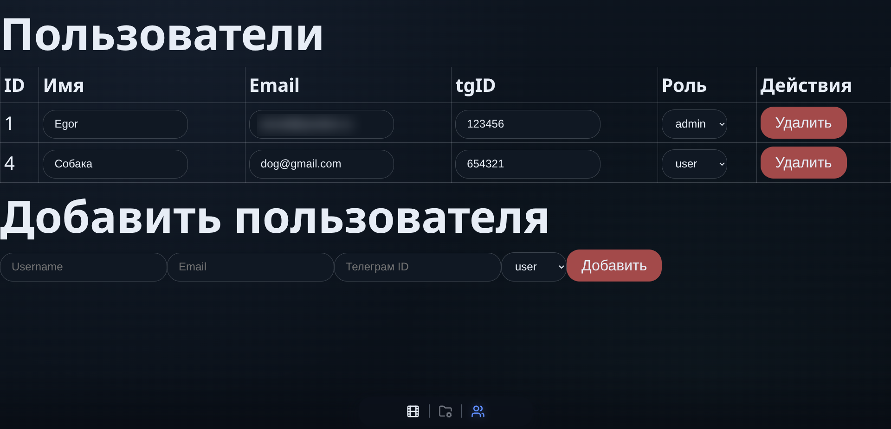
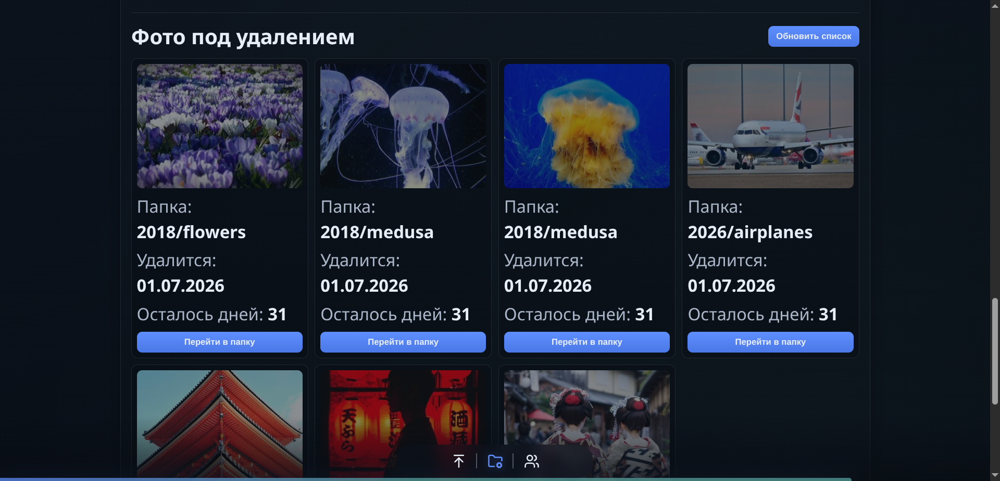

# Private Gallery

[Русская версия](README.md)

**A personal media gallery you fully control.**

Photos, videos, folders, users and access rules live on your server, in your storage, under your rules. No public photo platform, no consumer-cloud lock-in, no extra noise.

Private Gallery started as a tool for my own media archive: fast, private and comfortable to use every day. It has grown into a strong base for client work: family galleries, closed portfolios, personal archives, private media libraries or a self-hosted product for a small team.

## Why It Matters

Mainstream photo services are convenient as long as you accept their rules. Private Gallery solves a different problem: it gives the owner a polished interface and real control over the data.

- Store media in the S3-compatible storage you choose.
- Show photos and videos only to authenticated users.
- Manage folders, users and content order from an admin UI.
- Open originals through short-lived signed URLs.
- Deploy the app on your own server with Docker Compose.

## What It Includes

### Photo And Video Gallery

Folder cards on the home page, a masonry view inside each folder, a Swiper lightbox, keyboard navigation, an HD button for originals and video playback through prepared S3 variants.

### Privacy By Default

PostgreSQL-backed sessions, HTTP-only secure cookies, CSRF protection, `user` / `admin` roles, private API checks, Telegram and Yandex login for pre-approved users.

### Admin Workflows That Cover Real Use

Create and edit folders, change covers, manage users, upload new images, mark a preview as video, reorder media with drag-and-drop and remove content without touching files manually.

### Smart Media Handling

Originals stay separate, while lightweight WebP display versions are generated for `preview`, `screen-1280`, `screen-1920` and `screen-2560`. The gallery uses local cache to show previously opened folders faster.

### Safe Deletion

Deletion is soft first: media is hidden from the gallery, remains visible in edit mode, can be restored and is removed permanently only after the retention period. There is a dedicated screen for all files waiting for cleanup.

### Background Processing

Uploads, reorder operations and soft delete tasks run through RabbitMQ workers. Reorder is more than a UI shuffle: the system renames related S3 variants, verifies hashes and exposes processing status.

## Why It Works Well For Clients

Private Gallery covers both the viewing experience and ownership of the system. A client gets a clear product: a private-first gallery that can be deployed, branded, customized around a workflow and kept independent from consumer photo-cloud platforms.

The project already includes the pieces that usually appear after the first demo: authentication, roles, admin screens, storage, optimized media versions, background jobs, soft deletion and repeatable deployment.

## Screenshots

<table>
  <tr>
    <td width="50%">
      
      <br />
      <sub><strong>Home.</strong> Folders with covers, years and media count.</sub>
    </td>
    <td width="50%">
      
      <br />
      <sub><strong>Folder.</strong> Fast masonry view for browsing a collection.</sub>
    </td>
  </tr>
  <tr>
    <td width="50%">
      
      <br />
      <sub><strong>Photo.</strong> Lightbox with slider navigation and original access.</sub>
    </td>
    <td width="50%">
      
      <br />
      <sub><strong>Video.</strong> Private playback through signed media URLs.</sub>
    </td>
  </tr>
  <tr>
    <td width="50%">
      
      <br />
      <sub><strong>Folder editor.</strong> Upload, preview, ordering and delete controls.</sub>
    </td>
    <td width="50%">
      
      <br />
      <sub><strong>Folders.</strong> Create, order, cover and rename galleries.</sub>
    </td>
  </tr>
  <tr>
    <td width="50%">
      
      <br />
      <sub><strong>Users.</strong> Email, Telegram ID and access roles.</sub>
    </td>
    <td width="50%">
      
      <br />
      <sub><strong>Soft delete.</strong> Files waiting for final cleanup.</sub>
    </td>
  </tr>
</table>

## Under The Hood

```text
Browser
  |
  v
Traefik / HTTPS
  |
  +-- Nginx -> React frontend
  |
  +-- Express API
        |
        +-- PostgreSQL: users, sessions, cards
        +-- S3-compatible storage: originals, previews, videos
        +-- RabbitMQ -> worker: upload, reorder, soft delete
```

## Stack

- **Frontend:** React 19, Vite, React Router, Swiper, React Responsive Masonry, DnD Kit, Lucide React, Sileo.
- **Backend:** Node.js, Express 5, PostgreSQL, `express-session`, `connect-pg-simple`, `csurf`, Helmet, Multer, Sharp.
- **Storage & jobs:** S3-compatible storage, signed URLs, RabbitMQ workers.
- **Infra:** Docker Compose, Traefik, Nginx, PostgreSQL, RabbitMQ.

## Media Storage

Photos:

```text
original_photo/{year}/{category}/{name}.{ext}
preview/{year}/{category}/{name}.webp
screen-1280/{year}/{category}/{name}.webp
screen-1920/{year}/{category}/{name}.webp
screen-2560/{year}/{category}/{name}.webp
```

Videos:

```text
preview/{year}/{category}/video_{name}.webp
video_1440/{year}/{category}/{name}.mp4
video_1080/{year}/{category}/{name}.mp4
video_720/{year}/{category}/{name}.mp4
```

Video playback expects prepared MP4 variants in S3-compatible storage. The admin upload flow can upload a preview image and mark it as a video item.

## Deploy On Ubuntu 24.04

### 1. Docker

```bash
sudo apt update
sudo apt install -y ca-certificates curl

sudo install -m 0755 -d /etc/apt/keyrings
sudo curl -fsSL https://download.docker.com/linux/ubuntu/gpg -o /etc/apt/keyrings/docker.asc
sudo chmod a+r /etc/apt/keyrings/docker.asc

sudo tee /etc/apt/sources.list.d/docker.sources <<EOF
Types: deb
URIs: https://download.docker.com/linux/ubuntu
Suites: $(. /etc/os-release && echo "${UBUNTU_CODENAME:-$VERSION_CODENAME}")
Components: stable
Signed-By: /etc/apt/keyrings/docker.asc
EOF

sudo apt update
sudo apt install -y docker-ce docker-ce-cli containerd.io docker-buildx-plugin docker-compose-plugin

docker -v
docker compose version

sudo systemctl start docker
sudo systemctl enable docker
```

### 2. Project

```bash
sudo apt install -y git
git -v

git clone https://github.com/EgorBabin/private-gallery.git
cd private-gallery
ls -a
```

### 3. Environment

```bash
cp .env.example .env
nano .env
```

Fill in the main values:

- `SERVER_NAME`, `LE_EMAIL`, `FRONTEND_URL` - domain and HTTPS.
- `SESSION`, `SESSION_SECRET` - sessions.
- `S3_BUCKET`, `S3_REGION`, `S3_ENDPOINT`, `S3_ACCESS_KEY_ID`, `S3_SECRET_ACCESS_KEY` - S3-compatible storage.
- `PG_USER`, `PG_PASSWORD`, `PG_HOST`, `PG_PORT`, `PG_DATABASE` - PostgreSQL.
- `RABBITMQ_*` - background job queue.
- `APP_INIT_*` - first user.
- `YANDEX_*` - Yandex OAuth.
- `VITE_TG_BOT_USERNAME`, `TG_BOT_TOKEN`, `TG_CHAT_ID` - Telegram login and notifications.

### 4. Docker Permissions

```bash
sudo usermod -aG docker [your_linux_username]
newgrp docker
```

### 5. Start

```bash
docker compose build
docker compose up -d
docker compose ps -a
```

Logs:

```bash
docker compose up
```

## Who It Fits

- Personal self-hosted gallery.
- Family or travel archive.
- Closed portfolio.
- Private client preview for photographers, designers and studios.
- Base for a custom media-management product.

## Open Source

The project is released under the MIT License. See [LICENSE](LICENSE).

# Made with ❤️